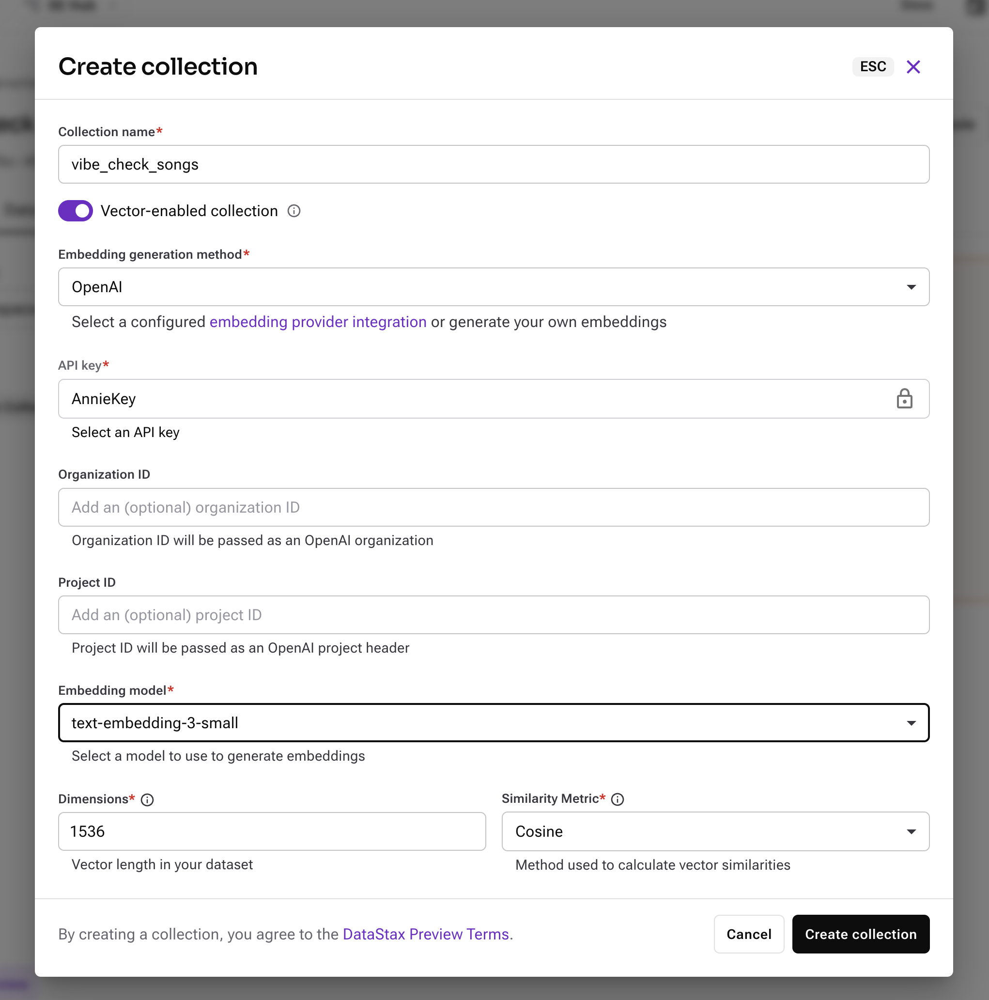
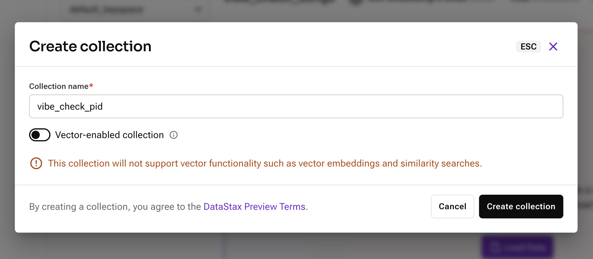

# Vibe Check - Multimodal Music Search Application

### Intro:
Struggling to find the perfect soundtrack for every moment? Whether you're powering through a workout, setting the mood for a dinner party, or studying for a big exam, having the right songs playing can make all the difference. Vibe check allows you to upload images/text and receive curated songs based on your vibe!

### Overview:
This notebook shows you how to use AstraDB and OpenAI to perform vector similarity searches and multi-modal Retrieval Augmented Generation (RAG)

### Before you get started:
Make sure you have the following:


*   Astra DB account. You can sign up with a free account [here](https://astra.datastax.com)
*   OpenAI Account
*   Spotify Account with a playlist

[](https://vibe-check.streamlit.app/)

### How to run it on your own machine

1. Install the requirements

   ```
   $ pip install -r requirements.txt
   ```

2. Gather your credentials. 
   
   Create a copy of `example.secrets.toml` and name it `secrets.toml`. You will replace the credentials there with your own.
   - [Create a vector database in Astra](https://docs.datastax.com/en/astra-db-serverless/get-started/quickstart.html#create-a-serverless-vector-database). It will take a few minutes to become active. Once it is active you can then retrieve your ASTRA_DB_API_ENDPOINT and ASTRA_DB_APPLICATION_TOKEN from your Database Details section.
   - ASTRA_DB_COLLECTION_NAME and ASTRA_DB_PID_COLLECTION_NAME will be set in the next step.
   - SPOTIFY_CLIENT_ID and SPOTIFY_CLIENT_SECRET: [Create a Spotify App and retrieve your Spotify Client ID and Client Secret](https://developer.spotify.com/documentation/web-api/concepts/apps).
   - OPENAI_API_KEY: [Create an OpenAI API key and save it](https://platform.openai.com/docs/quickstart). In order to avoid errors or rate limits, you may have to add some balance to your OpenAI API account. Please see the instructions for adding a payment method to OpenAI for the API [here](https://help.openai.com/en/articles/9038407-how-can-i-set-up-billing-for-my-account).
   

3. Set up your collections using Astra Vectorize
   - With your OpenAI API key, [follow these steps to integrate OpenAI as an embedding provider for Astra DB](https://docs.datastax.com/en/astra-db-serverless/integrations/embedding-providers/openai.html). Make sure that your new database is within the scope of your newly added API key. This example uses the OpenAI vectorize integration, but you can use a different embeddings model if preferred. This code uses OpenAI GPT-4o to generate text, so you do still need the OPENAI_API_KEY in order to run the code as-is.
   - Now that your integration is set up, you can create your collections using the integration. 
      - In the Data Explorer, create a new vector collection for your songs and give it a meaningful name. This will be your ASTRA_DB_COLLECTION_NAME.
      
      - Also create a new non-vector collection for tracking the current Playlist ID in your app, and give it a meaningful name. This will be your ASTRA_DB_PID_COLLECTION_NAME.
      
   - You should now have everything needed in your secrets.toml file to run the application!

4. Run the app

   ```
   $ streamlit run streamlit_app.py
   ```

If you want to deploy the application on Streamlit Community Cloud, [follow these instructions](https://docs.streamlit.io/deploy/streamlit-community-cloud/deploy-your-app/deploy).
